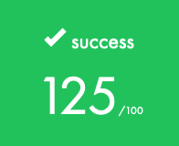

## Minitalk

The purpose of this project is to code a small data exchange program using UNIX signals. <br><br>

## Mandatory Part <br>
• You must create a communication program in the form of a client and server. <br> 
• The server must be launched first, and after being launched it must display its PID. <br>
• The client will take as parameters: <br>
◦ The server PID. <br>
◦ The string that should be sent. <br>
• The client must communicate the string passed as a parameter to the server. <br>
  &ensp; Once the string has been received, the server must display it. <br>
• Communication between your programs should ONLY be done using UNIX signals. <br>
• The server must be able to display the string pretty quickly. By quickly we mean that if you think it is too long, <br>
  &ensp; then it is probably too long (hint: 1 second   for 100 characters is COLOSSAL) <br>
• Your server should be able to receive strings from several clients in a row, without needing to be restarted. <br>
• You can only use the two signals SIGUSR1 and SIGUSR2. <br><br>

## Bonus

• The server confirms every signal received by sending a signal to the client. <br>
• Support Unicode characters! <br><br>

## Badge

<br>

## Skills

- Rigor
- Unix<br>

## My grade

<br>

## Use:

🚧 Cloning:<br/>
```
git clone https://github.com/alezamarion/42-minitalk.git && cd 42-minitalk
make
```

🚧 Compiling:<br/>
```
First you launch server:
$ ./server
Server will print its PID and wait

So you use the client to send string or unicode characters to the server
$ ./client PID_SERVER STRING
```
### Made with: <br/>

### Alexandre Zamarion
<div style="display: inline_block">
 <a href="https://github.com/alezamarion" target="_blank"></a>
 <a href="https://www.linkedin.com/in/alexandre-zamarion-cepeda-a3766323a/" target="_blank"></a> 
</div>

### Jorge Alves
<div style="display: inline_block">
 <a href="https://github.com/jorgeedualves/jorgeedualves" target="_blank"></a>
 <a href="https://www.linkedin.com/in/jorge-eduardo-alves-094b4331/" target="_blank"></a> 
</div>

### Alfredo Neto
<div style="display: inline_block">
 <a href="https://github.com/Alfredo-Neto" target="_blank"></a>
 <a href="https://www.linkedin.com/in/alfredo-neto-a2515814b/" target="_blank"></a> 
</div>


